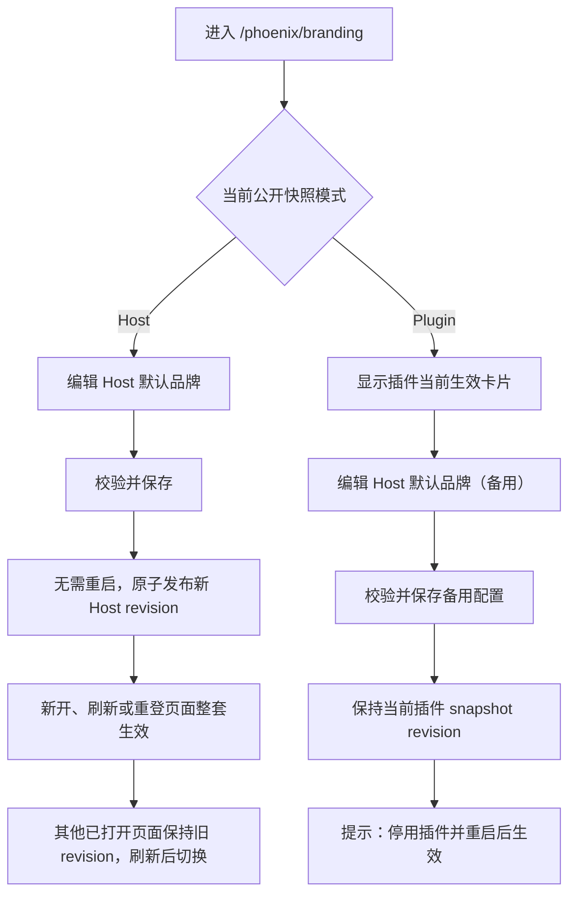
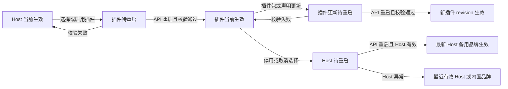

# Phoenix Admin 品牌二元生效整改计划

> **状态：规则已确认，尚未实施**<br>
> **冻结日期：2026-08-31**<br>
> 本文先统一 Admin Vue、Admin Node/Pah 与 Branding 的目标契约。源码整改、服务重载和真实浏览器验收必须在计划评审后另行开始。

## 一句话结论

Phoenix 只保留两个完整品牌来源：

1. **Host 当前生效**：Host 默认品牌可编辑，保存后发布新的 Host 快照；
2. **品牌插件当前生效**：插件整套品牌覆盖 Host；Host 默认品牌仍可编辑，但只保存为备用配置，停用插件并重启后才发布。

品牌字段不得在 Host 与插件之间逐项混合。界面必须分别说明“保存到哪里”和“现在谁在生效”。

---

## 1. 为什么调整

现场已经确认：

- 无活动 Acme 时，Host 设置可以影响登录后的工作台左上角；
- 登录页左右区域、浏览器标题和 favicon 尚未完整消费同一份 Host 快照；
- Acme 活动时品牌能够显示，但 Host 设置页没有解释字段是否会生效；
- 按字段声明 `hostBindings/effectiveSources` 会让管理员难以判断最终结果，也让插件与 Host 互相理解过多。

如果插件活动时把 Host 表单全部禁用，管理员必须先撤下插件才能准备回退品牌，操作窗口不必要地变长。因此，Host 默认品牌在任何模式下都可以维护，但插件活动时它只是**备用配置**。

## 2. 名词与真源

| 名称 | 含义 | 权威所有者 |
| --- | --- | --- |
| Host 默认品牌 | 管理员保存的标题、副标题、浅色 Logo、深色 Logo | Admin Node/Pah |
| 当前公开快照 | 登录首帧、标题/favicon 和工作台共同消费的不可变 revision | Admin Node/Pah |
| 活动品牌插件 | 已选择、已校验，并在最近一次受控重启后发布为当前快照的插件 | Admin Node/Pah |
| 待生效变化 | 插件选择、启停或声明已经改变，但尚未经过受控重启发布 | Admin Node/Pah |
| 品牌插件声明 | 插件提供的完整静态文案和资源收据 | Branding |

“已安装”不等于“当前生效”。磁盘上存在、已经挂载但未选择，或处于待重启状态的插件，都不能被页面误报为当前品牌来源。

## 3. 冻结决策

### DEC-01：整套二元来源

- `mode=host`：标题、副标题、浅色 Logo、深色 Logo 全部来自 Host；
- `mode=plugin`：全部来自同一个活动插件；
- 不支持按字段继承、覆盖或混合；
- 不保留 `hostBindings` 和 `effectiveSources` 作为产品契约。

### DEC-02：Host 默认品牌始终可维护

品牌插件当前生效时：

- Host 表单、Logo 上传、保存和恢复默认仍可操作；
- 编辑区标题改为“Host 默认品牌（备用）”；
- 页面另设“当前生效品牌”只读卡片，显示插件名称、模块、版本和 snapshot revision；
- 保存成功只表示 Host 备用配置已持久化，不改变当前插件快照；
- 成功反馈固定表达为：

> Host 默认品牌已保存为备用配置。当前仍由品牌插件控制；停用或取消选择插件并重启 Admin API 后生效。

### DEC-03：不要求卸载插件

切回 Host 的最短流程是：

1. 在插件活动期间提前维护并保存 Host 备用品牌；
2. 停用或取消选择品牌插件；
3. 重启 `admin-api`；
4. Node 校验并发布最新 Host 品牌 revision。

卸载属于包生命周期操作，不应成为切换品牌的前置条件。

### DEC-04：保存与应用必须分开

| 当前模式 | 保存 Host 配置 | 是否修改当前公开快照 | 用户反馈 |
| --- | --- | --- | --- |
| Host 生效 | 持久化并校验，无需重启 | 是，原子发布新 Host revision | “已保存并应用；其他已打开页面刷新后切换” |
| 插件生效 | 持久化并校验 | 否，插件 revision 不变 | “已保存为备用，尚未应用” |

Host 配置保存继续使用 revision/CAS。插件活动期间，Host 配置 revision 可以变化，但公开 snapshot revision 必须保持不变。

“Host 保存后立即生效”专指服务端已经发布新的不可变 snapshot revision：

- 当前设置页预览立即更新；
- 此后新打开、刷新或重新登录的页面使用新 revision；
- 已经打开的其他工作台继续使用其启动时读取的旧 revision，不做 DOM 热替换；
- 不使用 WebSocket、轮询或 `MutationObserver` 强制在线页面换肤；
- API/Web 都不需要因为 Host 纯数据修改而重启。

要求重启也不能让已经打开的 SPA 自动切换品牌，因此 Host 纯数据保存不以重启作为生效门槛。

### DEC-05：插件变化经重启原子发布

以下变化先进入“待重启”，不直接改写浏览器当前品牌：

- 启用、停用或取消选择品牌插件；
- 切换活动品牌插件；
- 更新插件 manifest、品牌文案或资源；
- 开发挂载指向的新插件 commit。

`admin-api` 受控重启时完成发现、校验和原子发布。发布成功后得到新的不可变 snapshot revision；页面刷新、重新登录、Web HMR 和 Host 备用配置变化都不能改变它。

重启门槛只适用于插件生命周期与插件制品变化，不适用于当前 Host 品牌的普通字段保存。

### DEC-06：失败保持 last-known-good

- 首次启用插件失败：保持当前 Host 快照；
- 更新活动插件失败：保持上一个可用插件快照；
- 停用插件时 Host 备用配置异常：优先使用最近一次已验证 Host 配置；仍不可用才回退内置 Phoenix 品牌；
- 任意失败都不得发布“插件 Logo + Host 标题”等半套品牌；
- UI 和 Runtime 日志必须显示失败原因及仍在生效的 revision。

## 4. 生效流程

### 4.1 修改 Host 默认品牌



### 4.2 启用、更新和停用插件



## 5. 设置页目标布局

```text
┌──────────────────────────────────────────────────────────────┐
│ 当前生效品牌                                                 │
│ [品牌插件] Acme Workspace · phoenix-branding@0.x · rev abc │
│ 当前快照已固化；Host 备用配置变化不会影响登录页。             │
└──────────────────────────────────────────────────────────────┘

┌──────────────────────────────────────────────────────────────┐
│ Host 默认品牌（备用）                                        │
│ 标题 / 副标题 / 浅色 Logo / 深色 Logo                        │
│ [恢复 Host 默认]                                  [保存备用] │
│ 停用或取消选择品牌插件并重启 Admin API 后生效。               │
└──────────────────────────────────────────────────────────────┘

┌──────────────────────────────────────────────────────────────┐
│ 品牌运行点检                                                 │
│ [开始点检]  结果同步写入 Runtime 日志窗口                    │
└──────────────────────────────────────────────────────────────┘
```

当 Host 当前生效时，第二张卡片去掉“备用”字样，保存按钮改为“保存并应用”。

页面不得使用绿色“已生效”反馈描述仅完成持久化的备用配置。

## 6. 三仓职责

### Admin Vue

- 在 Vue mount 前消费唯一公开快照；
- 登录页左右区域、`document.title`、favicon 和工作台左上角消费同一 revision；
- 展示“当前生效品牌”和“Host 默认/备用品牌”；
- 根据当前模式输出准确的保存反馈；
- 提供人工点检入口，并把逐项结果写入 Runtime 日志窗口；
- 不以 localStorage、DOM 探测或 `MutationObserver` 决定品牌真源。

### Admin Node/Pah

- 持久化 Host 默认品牌及其配置 revision；
- 持久化品牌选择与待重启状态；
- 校验插件 manifest 和资源收据；
- 在启动时原子发布完整、不可变的公开 snapshot revision；
- 插件活动时允许保存 Host 备用配置，但不得重新物化当前插件快照；
- 负责 last-known-good、内置默认、并发 CAS 和损坏快照恢复。

### Branding

- 提供完整固定的标题、副标题、Logo、favicon 等静态声明和资源；
- 保留旧完整静态声明的兼容能力；
- 不提供 Host 字段绑定、不读取 Host 配置；
- 不修改登录 DOM、工作台 DOM 或 document head；
- 不复制认证、数据库、选择器、快照发布器和生命周期实现。

## 7. `326eb4b` 以后变更的点检结论

| 变更 | 初步结论 | 后续处理 |
| --- | --- | --- |
| `326eb4b` Phoenix Hub 命名同步 | 与品牌来源模型无冲突 | 保留 |
| Admin 登录首帧 bootstrap | 解决闪烁和静态首帧所必需 | 保留并补测 |
| 登录页、标题/favicon、工作台统一消费 | 是本次问题的核心修复方向 | 保留并收敛到整套快照 |
| snapshot revision、资源校验、CAS、last-known-good | 仍然必要 | 保留并补生命周期测试 |
| Branding runtime 不再改写品牌 DOM | 符合职责边界 | 保留 |
| `hostBindings/effectiveSources` v3 | 与二元整套来源冲突 | 由后续提交替换，不整体回退其他有效改动 |
| Acme 四项声明为 `host-default` | 会使插件失去固定品牌含义 | 恢复为完整插件静态品牌 |

实施前必须对 Admin Vue `42872f5`、Admin Node `9c8aa58`、Branding `48ad42f` 做逐文件保留/替换清单，不能用整提交回退代替审计。

## 8. 分阶段实施计划

> 本节是待执行计划，当前所有阶段均未开工。

### P0 — 契约定稿

- 更新三仓正式契约，去除按字段来源；
- 固化“当前生效 / Host 备用 / 待重启”术语；
- 把本计划映射到自动化点检表。

**出口门禁：** 三仓文档无相互矛盾，旧 v3 说明有明确迁移标记。

### P1 — Node/Pah 真源与生命周期

- 收敛为完整 Host 或完整插件快照；
- 插件活动时允许 Host 备用配置保存，但不发布；
- 插件启停/更新在重启时发布；
- 保留 CAS、资源校验和 last-known-good。

**出口门禁：** Node 聚焦测试覆盖保存、发布、待重启、恢复和损坏候选。

### P2 — Admin Vue 消费与设置页

- 统一登录左右、标题/favicon 和工作台消费者；
- 实现当前生效卡片、Host 备用编辑与准确反馈；
- 增加 Runtime 点检入口；
- 移除按字段来源 UI。

**出口门禁：** Vue 单测覆盖两种模式及“已保存但未应用”。

### P3 — Branding 静态契约

- Acme 恢复为完整固定品牌声明；
- 保持 runtime 无品牌 DOM 投影；
- 更新 manifest、制品校验和产品测试。

**出口门禁：** Branding 自验证通过，且没有 Host 源码、认证或生命周期耦合。

### P4 — 稳定测试组联合验收

- 先跑三仓门禁，再只重载 `admin-api`（8101）和 `admin-web`（9000）；
- 验证无活动 Acme、活动 Acme、Acme → Host 恢复；
- 验证刷新、重新登录、API/Web 重启、首帧无闪烁和 console 无 error；
- 更新点检表证据后形成三仓可回滚中文本地提交。

**出口门禁：** “保存”“待重启”“当前已应用”三种状态均有 API、自动化和浏览器证据。

## 9. 边界与回滚

- 不执行插件安装、DDL、数据库重置或其他 Hub 组重启；
- 不覆盖 Admin 主工作树现有用户 dirty 文件；
- 不把 Branding 源码放进 Admin，不引入 submodule、file/link/workspace override；
- 不修改 `node_modules`；
- 每仓独立中文提交，不 push、不 tag；
- 重载前记录精确 branch、HEAD、进程 cwd、端口和 dirty owner；
- 任一阶段失败时只回滚该仓对应提交，公开快照继续使用 last-known-good。

## 10. 实施开始条件

只有以下条件同时满足才进入源码整改：

- [x] 产品规则已确认；
- [x] 允许插件活动时维护 Host 备用品牌；
- [x] 切回 Host 不要求卸载插件；
- [x] 插件启停/更新经 API 重启发布；
- [x] 当前 Host 品牌保存后无需重启，原子发布并在新开/刷新/重登页面生效；
- [x] 已打开页面不做品牌热替换，继续使用启动时 revision；
- [ ] 三仓正式契约已按本计划更新；
- [ ] 逐文件保留/替换清单已完成；
- [ ] 用户明确同意开始实施。
